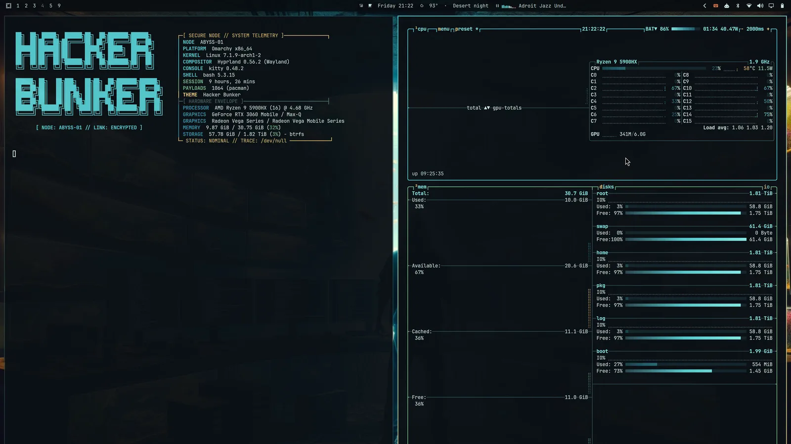
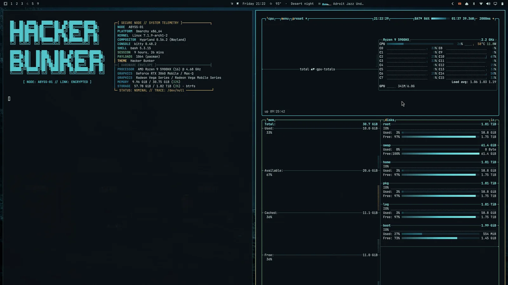
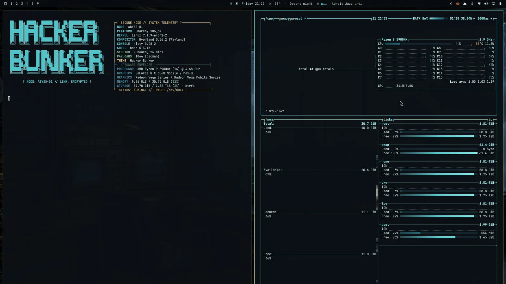

# Hacker Bunker

An Omarchy theme built around a submerged, clandestine operations room.
It favors credible hacker atmosphere over generic neon cyberpunk: blackened
infrastructure, cyan telemetry, phosphor status green, aquarium amber, and
sparingly used incident red.

## What is themed

- Omarchy's generated terminal, Hyprland, editor, and application palettes
- Omarchy Shell bar, launcher, menus, notifications, lock UI, and controls
- Hyprland's active and inactive border signals
- btop graphs and system telemetry
- Chromium frame color
- Supported RGB keyboard accent
- Desktop icons
- Three switchable wallpapers and a real desktop preview
- Animated Hacker Bunker screensaver branding
- Theme-scoped Hacker Bunker Fastfetch identity
- Safe restoration of the user's previous branding when changing themes

## Desktop previews

| Original Hacker Bunker | Abyss Relay | Numbers Station |
| --- | --- | --- |
| [](preview.png) |  |  |

Click the original preview for the full-resolution desktop capture.

## Install

```bash
omarchy theme install https://github.com/majesticio/omarchy-hacker-bunker-theme.git
```

That installs and activates the core visual theme: palette, shell treatment,
wallpapers, btop, Chromium, icons, keyboard RGB, and generated application
colors.

### Optional Hacker Bunker identity

Install the included theme hook to add the custom screensaver, About art, and
Fastfetch console. The hook safely restores your previous files when you switch
away:

```bash
omarchy hook install theme-set \
  ~/.config/omarchy/themes/hacker-bunker/hooks/hacker-bunker-theme-set
omarchy theme set hacker-bunker
```

## Develop from this working tree

Linking the directory keeps local edits live and lets Omarchy treat it as a
theme you authored:

```bash
mkdir -p ~/.config/omarchy/themes
ln -s "$PWD" ~/.config/omarchy/themes/hacker-bunker
omarchy hook install theme-set hooks/hacker-bunker-theme-set
omarchy theme set hacker-bunker
```

If that destination already exists, remove or rename it yourself before
creating the link.

The published repository name resolves to the theme slug `hacker-bunker`.

## Optional finishing touch

A narrow Nerd Font strengthens the operator-console look without making the UI
theatrical:

```bash
omarchy font set "JetBrainsMono Nerd Font"
```

Use `omarchy font list` if that exact family is unavailable.

## How the optional identity hook behaves

The `theme-set` hook manages the screensaver and Fastfetch identity. On first
activation it saves the existing files under:

```text
~/.local/state/omarchy/hacker-bunker-extras/
```

Selecting Hacker Bunker installs its branding. Selecting another theme restores
the saved files, but only when the live files still match this theme—manual
changes are never silently overwritten during restoration.

## Wallpapers

The theme includes three states:

1. `1-hacker-bunker.png` — the original aquarium command room
2. `2-abyss-relay.png` — a subsea communications outpost and cable network
3. `3-numbers-station.png` — a stormbound analog signals-intelligence room

Cycle them with:

```bash
omarchy theme bg next
```

## Screensaver

Omarchy animates the 68-column Hacker Bunker surveillance console through its
terminal-effects engine.

Preview it without waiting for the idle timer:

```bash
omarchy-launch-screensaver force
```

Any key or pointer activity dismisses the saver. Omarchy's normal secure lock
deadline remains unchanged.

## Rebuilding the preview

The capture helper creates a temporary workspace with Fastfetch and a
CPU/memory-only btop view. It closes global shell panels before capture, removes
its own windows, and returns to the original workspace:

```bash
./tools/capture-preview.sh "$PWD/preview.png"
```

## License and artwork

Theme configuration and helper scripts are MIT licensed. Wallpaper artwork is
excluded from that software license. The original wallpaper was created by the
theme author; the two companion scenes were generated specifically for this
theme. See [`CREDITS.md`](CREDITS.md) for provenance and artwork terms.
